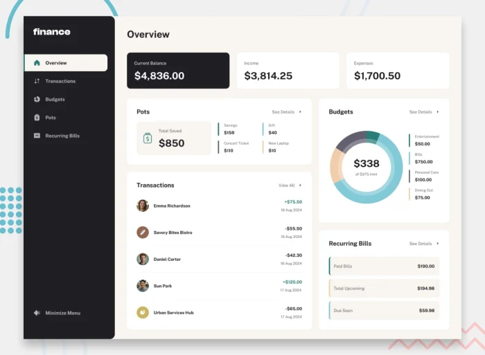

# 💰 Personal Finance Dashboard


Un'applicazione web full-stack per la gestione delle finanze personali, sviluppata con **Angular** (frontend) e **ASP.NET Core** (backend).  
Permette di monitorare bilanci, transazioni, budget, pots (obiettivi di risparmio), e spese ricorrenti.

---

## 🚀 Funzionalità principali

- ✅ Panoramica in tempo reale di saldi, entrate e spese
- 🔍 Ricerca, filtro e ordinamento delle transazioni
- 🧾 CRUD completo per gestione di budget e pots
- 📊 Visualizzazione dei progressi di risparmio (pots)
- 💸 Gestione bollette ricorrenti con stato (pagato / in scadenza)
- 🧠 Accessibilità migliorata (supporto tastiera)
- 📱 UI responsive e ottimizzata per dispositivi mobili
- 🔐 Autenticazione (bonus) e persistenza su database

---

## 🛠️ Tecnologie utilizzate

### Frontend
- **Angular 17+**
- **SCSS / Tailwind CSS**
- **Chart.js / ngx-charts**
- **TypeScript**, Reactive Forms, Routing, Lazy Loading

### Backend
- **ASP.NET Core Web API**
- **Entity Framework Core**
- **SQLite / SQL Server**
- **Architettura a microservizi**
- **Pattern multilivello (Controller → Service → Data → DTO/Model)**
- **Dependency Injection nativa**
- **Swagger (opzionale)**

---

##  📁 Architettura del frontend
<pre> ``` 
Frontend-Angular/
├── src/
│ ├── app/
│ │ ├── services/ --> Servizi comuni, comunicazione HTTP
│ │ ├── components/ --> Componenti riutilizzabili
│ │ ├── pages/ --> Overview, Transactions, ecc.
│ │ └── models/ --> Interfaces per dati (Transaction, Pot, ecc.)
│ ├── assets/ --> Immagini, icone, data.json
│ └── environments/
├── angular.json
└── package.json
 ``` </pre>
 ---
## 🧱 Architettura del backend (ASP.NET Core Web API)
<pre> ```
Backend-ASP.NET/
├── BillsService/
├── BudgetsService/
├── PotsService/
├── TransactionsService/
│ ├── Controllers/
│ ├── Services/
│ ├── Models/
│ ├── DTOs/
│ ├── Data/
│ ├── Migrations/
│ ├── Program.cs
│ └── appsettings.json
├── PersonalFinanceWeb/
│ └── (progetto gateway/API principale)
 ``` </pre>
---
🙋‍♂️ Author

Mohamed Mousa:
🔗 Portfolio: http://mohamedmousa.it
